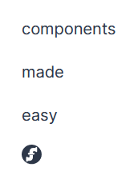

# Components library



Beginning with the [release 0.8](https://github.com/jwstegemann/fritz2/releases/tag/untagged-950f0551d012cc3256f3) 
fritz2 offers its own components library that covers basic components for creating modern HTML based user interfaces. 
We do not intend to provide myriads of components with subtle differences and lots of pre built variants, 
instead we focus on the most common ones. 

We believe that it is more important to offer...
 - a strong foundation of principles and patterns
 - composable elements (by structure and interaction)
 - some thoughtful crafted APIs
  
 ... in order to...
  - use
  - customize 
  - compose existing components
  - write new ones from scratch.
  
In contrast to the _pure_ ability to create [components](Components.html) without any deeper restrictions, we provide 
with our library ready to use components that follow consistent rules and APIs and always consider customizing or
composition aspects as first class citizen.



Our components are _heavily_ inspired by the incredible [Chakra UI](https://chakra-ui.com/) components library.
Instead of artificially reinventing the wheel, we chose to adopt its beautiful structure, look and feel and ease of
composition with our fritz2 based approach. Feel free to have a look at this amazing project and get inspiration for
missing components, we do not deliver per default.

As icon set we chose to include the beautiful [mono icons](https://icons.mono.company/). They fit perfectly to our needs
to include a sufficient, but not overwhelming variety of icons. Their look and feel is clear and consistent which makes
them a joy to apply to our default theme and use them within our components. 
  
## Showcase

Just to show you an impression, here is a screenshot from our showcase app:


Please refer to this for a detailed overview about the components and their features.

fritz2 currently offers the following components:

- Layout:
  - ``flexbox``
  - ``gridbox``
  - ``stackUp``
  - ``lineUp``
- Overlay:
  - ``tooltip``
  - ``popover``
  - ``modal``
- Forms
  - ``pushButton``
  - ``clickButton``
  - ``inputField``
  - ``switch``
  - ``checkBox``
  - ``checkBoxGroup``
  - ``radiogroup``
  - ``formControl``
- Others:
  - ``icon``
  - ``spinner``
  
The following components will be added for the [0.9 release](https://github.com/jwstegemann/fritz2/milestone/5):

- Forms
  - ``textArea``
  - ``select``
  - ``dataTable``
- Feedback:
  - ``progress``
  - ``toast``
  
## Basics

A component in fritz2 is just a _function_, that takes some parameters and might have some individual return type.
It acts as a _factory_ function, that could render an arbitrary structure of HTML elements as result. 
Let's start with a very basic example:

```kotlin
render {
    stackUp { // ``stackUp`` is a component for stacking arbitrary elements vertically 
        items {
            p { +"components" }
            p { +"made" }
            p { +"easy" }
            // mix other components with basic HTML elements and vice versa!
            icon { // ``icon`` is a component for SVG based pictures
                fromTheme { fritz2 }                
            }
        }
    }
}
```

This would result in a representation that resembles the following screenshot:



As you can see in this example, the first component called `stackUp` is just a function, that can be used within any
render context. It only takes _one_ parameter here, that requires a _functional_ expression in order to _build_ the 
component. Within such a _build_ context, the appearance, behaviour and functionality of a component can be configured.
Each component offers specific functions within its _build_ context, that are tailored to the task of a component. 
To keep this example simple, we only use the _essential_ ``items`` function of the _build_ context of the 
``stackUp`` component in order to declare the sub-elements that should be part of the vertical stack layout.

Within the ``items`` sub-context of the ``stackUp`` component one can insert arbitrary elements, that is _functions_ 
that have a ``RenderContext`` as receiver, such as every HTML element or any other component. 
In this case there are three ``p``-functions and one ``icon`` function calls. The former construct basic HTML paragraphs,
the latter represents itself a component for showing SVG based icons. As you can see we mix up basic HTML elements with
components in the same _declarative_ context without any special ceremony or restriction.  

As every fritz2 component is defined as _extension method_ on the ``RenderContext`` interface, you can use them in any 
place, that offers such an object. 
This is how fritz2 realizes _structural_ composition of its components and so one of the mentioned _key features_.

You can change the _visual_ appearance of this _layout_ component in different ways:
 - configure specific properties within the _build_ context
 - apply custom styling via fritz2's [styling DSL](StylingDSL.html).
 
```kotlin
render {
    stackUp({ // provide a styling expression via the *first* parameter!
        alignItems { start }
        padding { small }
        background {
            color { light }
        }
    }) { // configure content *and* behaviour / appearance within the build context!
        reverse { true } // show items in reverse declaration order
        spacing { huge } // apply a margin between the items based upon the ``huge`` property of the theme's ``spacing``
        items {
            p { +"components" }
            p { +"made" }
            p { +"easy" }
            icon {
                fromTheme { fritz2 }
            }
        }
    }
}
```

This would result in a representation that resembles the following screenshot:


As you can see the items are now shown in the reverse order (due to ``reverse { true }``) and there is a huge _gap_
between them (``spacing { huge }``). Those two configurations are accomplished using **specific** functions of the
``stackUp`` component _build_ context. 

We modify the default alignment instead by applying a customized **styling** via the first parameter of the component.
The same mechanism is used for the padding and the background color.

As every fritz2 component offers such a ``styling`` parameter as its first argument, you can extend and override the
component's default styling quite easily.

It is intentional to provide two _"places"_ for modifying the appearance:
 - within the ``build`` context there are only options that modify **common** and often quite **complex** aspects, that
 would otherwise be cumbersome to style by hand. We love to abstract away complex CSS related stuff for common use 
 cases, as we believe that this will increase the usability. Lots of predefined values can be easily modified by
 changing the [theme](StylingDSL.html#styling-dsl-and-theming) btw., as they are often purely defined by styling expressions therein.
 - all the rest can be done within the ``styling`` argument! This could be trivial tasks like adding some ``padding`` or
 ``color``, but you are of course not limited to that (have a look for the [styling](StylingDSL.html) documentation for 
 a detailed explanation) 

Now you have already seen the three most important _patterns_ of fritz2 components:
 
 - structural composition via a ``RenderContext``-receiver (for component's factory functions themselves or within 
 their _build_ sub-contexts like ``items``)
 - configuration via the _build_ context argument for appearance (common use cases!), behaviour and content
 - arbitrary styling via the ``styling`` argument for every component
 
Let's now have a look how components fit into the _reactive_ nature of fritz2 and its concepts of 
[state management](StateManagement.html)     

## Getting interactive

Imagine you would like to show or hide some information by clicking on a _button_:
```kotlin
val toggle = storeOf(false) // true == visible, false == hidden

div {
    toggle.data.render { visible ->
        if (visible) {
            p { +"I am visible now!" }
        }
    }
    pushButton {
        text(toggle.data.map { if (it) "hide" else "show" })
        events {
            clicks.events.map { !toggle.current } handledBy toggle.update
        }
    }
} 
```


First of all we establish a simple ``Boolean`` [store](Store.html) for toggling between the states
_visible_ and _hidden_. We can use this store then to only show some information, if the state is currently ``true`` 
(aka _visible_). So far there is nothing new to discover.

Finally we use the ``pushButton`` component to realize the toggling between the two possible states. As we already have
shown, we provide a functional expression to use the _build_ context specific functions of such a button component.
As first step we declare the _label_ of the button in a dynamic way by providing a ``Flow<String>`` as argument.
We derive the former by mapping the boolean flow of our toggle-store to fitting command strings for the use case:

 - ``hide`` if the text is _visible_
 - ``show`` if the text is _hidden_
 
As second step we _open_ an ``events`` context in order to plug the _click_ event of the button to the toggle-store's 
update handler. The ``pushButton`` component offers explictly such a _context_ for managing the 
[events](https://developer.mozilla.org/en-US/docs/Web/API/Document_Object_Model/Events) of the underlying HTML element.
Many interactive components offer such a mechanism; often by using the same name ``events`` (that is for really 
exposing the _bare_ DOM events), sometimes also with more specific functions for specific _flows_. The _principle_
always remains the same: Offer a place to grab and use the event(s) of a component.

## Composition on steroids

The example above works fine, but can be slightly improved by using a _variant_ of the standard ``pushButton`` called
``clickButton``:

```kotlin
val toggle = storeOf(false)

div {
    toggle.data.render { visible ->
        if (visible) {
            p { +"I am visible now!" }
        }
    }
    // different variant of a button: 
    clickButton {
        text(toggle.data.map { if (it) "hide" else "show" })
    }.map { !toggle.current } handledBy toggle.update
}
```

The ``clickButton`` is basically the same as a ``pushButton`` and therefore behaves almost identically; it just offers
the _click_ event as **return** value. This rather small difference has a big impact of the composition abilities: 
It enables one to couple the _most common_ event of a button **directly** with some handler! 
This is less cumbersome to write and _read_ and supports the _declarative_ approach of our DSL very well.
You can fluently read and understand the setup like this:

_"The clickButton { with some label and maybe styling } is handledBy some handler"_ - the ``click`` prefix of the name
already brings the event into the brain's focus and triggers the understanding of what's going on here.

The ``clickButton`` thoughtfully takes advantage of its _return_ value in order to ease a _common use case_. This is
a typical example for other components or variants of them as well. So look out for those in order to enhance 
the composition of your components! 

To make this more explicit, let us introduce another component, that takes a similar approach from the opposite 
point of view: the _handler_ side!

A so called ``modal`` is a component function for showing a modal dialog or message box. Of course you don't want such
a dialog to always appear on the screen, as it would overlay all the rest of your page, but instead only if some
_event_ takes place... for example a button click!

```kotlin
clickButton {
    text("Open")
} handledBy modal {
    content { p { +"I am a modal dialog!" } }
}
```

First of all we set up a ``clickButton`` as already seen. Then the _magic_ happens: We can combine the _click_ event 
of the button with the ``modal`` component **without** any intermediate step! This is simply possible as ``modal`` 
returns a ``SimpleHandler<Unit>`` which can act as the sink for a ``Flow<Unit>``.

As we already agreed about, a modal dialog will almost always _react_ to some event, which is reflected by the design
decision to return a fitting type to ease the composition with other components, that emits some event (aka ``Flow<T>``).

In fact this (extreme simple) example is so minimalistic, that you can write everything into one line without a 
significant loss of readability:
 
```kotlin
clickButton { text("Open") } handledBy modal { content { p { +"I am a modal dialog!" } } }
```

Besides the _artificially minimalistic_ nature of the example above, it should make clear, that the _composition_ of
components is not only limited to the **structuring** but also expanded to the **interaction** between them and 
therefore a first class citizen of fritz2's components library!  

## Deep Dive

In order to really grasp the core concepts and patterns of our components, you should have a look at the main structures
of our components: the _factory_ functions!

The components function signatures follow a consistent pattern throughout the whole library:

```kotlin
fun RenderContext.generic(
    styling: BasicParams.() -> Unit = {},
    // additional arguments are placed here
    baseClass: StyleClass? = null,
    id: String? = null,
    prefix: String = "generic",
    build: GenericComponent.() -> Unit = {} // might be called ``init`` for basic components
) : Unit // return type might differ! (for example return some Flow<T> or Handler<T> for interaction based composition)
```

Let's step through this _generic_ signature:

 - the component function itself must be defined as _extension method_ on the ``RenderContext`` interface 
 (for structural composition)
 - all parameters should be optional
 - the ordering should always be the same and not change (The only exception are _additional_ parameters; see below)
 - the first parameter is for passing in some custom _styling_ via our [styling DSL](StylingDSL.html). Ths styling should
 be applied to the _best fitting_ ("TRANSLATION: am intuitiv richtigen") element of the resulting component; 
 often this is the _root_-element, but this might be different for good reasons 
 (have a look at the ``popover`` component for example; you would preferably want the 
 background color of the popover itself to change and not for the triggering element, wouldn't you?)
 - the second parameter is a ``StyleClass`` in order to provide a common CSS base class for the component
 - the third parameter defines the _id_ of the _root_ element of the component (remember that a component can result 
 in some complex structure!). Sub elements will often get ids with the root id as prefix, if they are created by the
 component itself.
 - the next parameter defines a _prefix_ for the _dynamic_ style classes created based upon the _first_ parameter. As
 the style classes are built with a _random_ name, the prefix establishes a reliable static part of the classname. This
 helps with debugging or analyzing tasks. 
 - the last parameter finally offers a _context_ for really defining the **content**, the **appearance** and a place
 for handling **events** or passing dynamic data into the component. (Notice that this parameter was the only one set 
 in the first basic example!) Sometimes the component only wraps _one_ HTML Element, like some of our _layout_ 
 components, so there is no need to expose custom configuration options within a special context object. 
 Then the parameter is called ``init`` and the receiver is  the generic ``RenderContext``-Interface or a specific 
 ``Tag<E>`` like ``Div``, for example ``init: Div.() -> Unit = {}``.
 - the ``return`` type might differ. Often ``Unit`` is sufficient, but for _layout_ components returning a ``Div`` is
 clearly a good idea or for interaction composition some type of ``Flow<T>`` or ``SimpleHandler<T>``.
 
Every component factory function of fritz2's own components follows these patterns!

There are only few exceptions to this rule, that offer _additional_ parameters (like the ``inputField``). Those are
placed **after the first** parameter, that is after ``styling`` and before ``baseClass``.

Don't be afraid of the amount of parameters, you will get used to them soon and often you don't need to set up all 
of them (as we show in the first example). If you need to, prefer to use 
[named arguments](https://kotlinlang.org/docs/reference/functions.html#named-arguments) in order to increase 
readability.
 

  
This is basically all you need to know about our components API so far!
