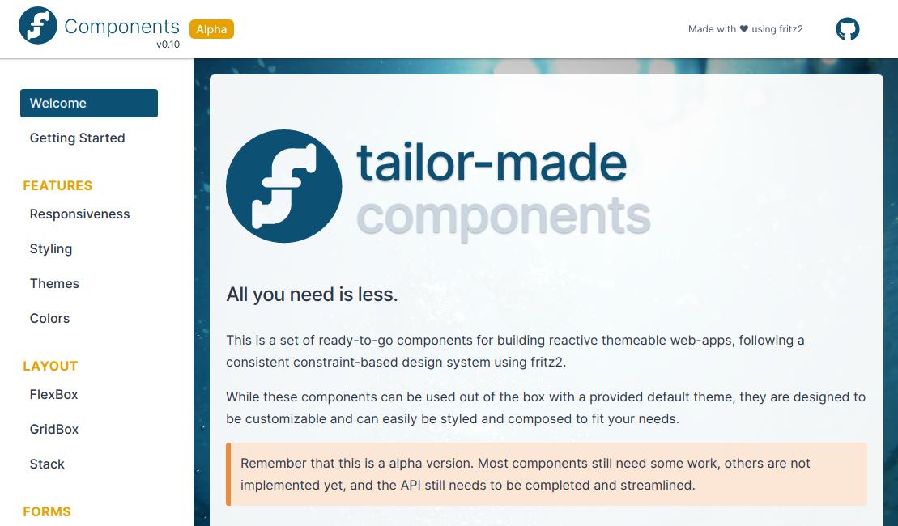
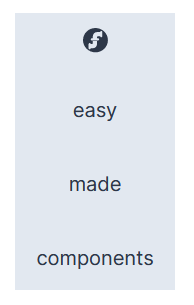
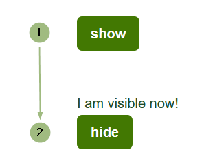

# Components library

This is just a preview release of our components in order to gain feedback from real 
world projects. We encourage our users to try it out and give us feedback, but keep in mind that the API is not final 
yet and therefore might change in future releases.

Beginning with the [release 0.8](https://github.com/jwstegemann/fritz2/releases/tag/untagged-950f0551d012cc3256f3) 
fritz2 offers its own components library that covers basic components for creating modern HTML based user interfaces. 
We do not intend to provide myriads of components with subtle differences and lots of pre-built variants, 
instead we focus on the most common ones. 

We believe that it is more important to offer...
 - a strong foundation of principles and patterns
 - composable elements (by structure and interaction)
 - some thoughtfully crafted APIs
  
 ... in order to...
  - use
  - customize
  - compose existing components and
  - write new ones from scratch
  
In contrast to solely providing the means to creating [components](Components.html) without deeper restrictions, this library provides
ready to use components that follow consistent rules and APIs, and always considers customizing and
composition aspects first class citizens.

You are in no way forced to use our components - they are now and will remain totally
optional. You will always be free to ignore our approach and do something completely different. The
fritz2 core will never depend on components.

Our components are heavily inspired by the incredible [Chakra UI](https://chakra-ui.com/) components library.
Instead of reinventing the wheel, we chose to adopt its beautiful structure, look and feel, and ease of
composition for our fritz2 based approach. Have a look at this amazing project and get inspiration for
components we do not deliver per default!

As icon set, we chose to include the beautiful [mono icons](https://icons.mono.company/). Their sufficient, but not 
overwhelming variety of icons fit our needs perfectly. Their look and feel is clear and consistent, 
which makes them a joy to apply to our default theme and use them within our components. 
  
## Showcase

For a first impression, here is a screenshot from our showcase app:


Please refer to this [project](https://github.com/jwstegemann/fritz2-kitchensink) for a detailed overview about the 
components and their features.

fritz2 currently offers the following components:

- Layout:
  - ``flexbox``
  - ``gridbox``
  - ``stackUp``
  - ``lineUp``
- Forms
  - ``pushButton``
  - ``clickButton``
  - ``inputField``
  - ``textarea``
  - ``switch``
  - ``checkBox``
  - ``checkBoxGroup``
  - ``radioGroup``
  - ``formControl``
- Feedback
  - ``spinner``
- Overlay:
  - ``tooltip``
  - ``popover``
  - ``modal``
- Icons:
  - ``icon``
  
The following components will be added for the [0.9 release](https://github.com/jwstegemann/fritz2/milestone/5):

- Forms
  - ``select``
  - ``dataTable``
- Feedback:
  - ``progress``
  - ``toast``
  
## Basics

A component in fritz2 is just a function that takes parameters and might have an individual return type.
It acts as a factory function that could render an arbitrary structure of HTML elements as a result. 
Let's start with a very basic example:

```kotlin
render {
    stackUp { // ``stackUp`` is a component for stacking arbitrary elements vertically 
        items {
            p { +"components" }
            p { +"made" }
            p { +"easy" }
            // mix other components with basic HTML elements and vice versa!
            icon { // ``icon`` is a component for SVG based pictures
                fromTheme { fritz2 }                
            }
        }
    }
}
```

The result looks like in the following screenshot:


As you can see in this example, the first component called `stackUp` is just a function that can be used within any
render context. It only takes one parameter here which requires a functional expression in order to build the 
component. Within such a build context, the appearance, behaviour, and functionality of the component can be configured.
Each component offers specific functions within its build context which are tailored to the task of the component. 
To keep this example simple, only the essential ``items`` function in the ``stackUp``s build context was used in order 
to declare the sub-elements of this vertical layout.

Within the ``items`` sub-context of the ``stackUp`` component, arbitrary elements with a ``RenderContext`` receiver 
can be inserted, meaning every HTML element or component. 
Our example uses three ``p``-functions and one ``icon`` function. The former construct basic HTML paragraphs,
the latter is a component for SVG based icons. As you can see, we mix basic HTML elements with
components in the same declarative context without special ceremony or restriction.  

Since every fritz2 component is defined as an extension method to the ``RenderContext`` interface, you can use them in 
any place that offers such an object. This is how fritz2 implements structural composition of its components, 
which is one of the mentioned key features.

You can change the visual appearance of this layout component in different ways:
 - configure specific properties within the build context
 - apply custom styling via fritz2's [styling DSL](StylingDSL.html).
 
```kotlin
render {
    stackUp({ // provide a styling expression via the first parameter
        alignItems { center }
        padding { small }
        background {
            color { light }
        }
    }) { // configure content and behaviour / appearance within the build context
        reverse { true } // show items in reverse declaration order
        spacing { huge } // apply a margin between the items based on the ``huge`` property of the theme's ``spacing``
        items {
            p { +"components" }
            p { +"made" }
            p { +"easy" }
            icon {
                fromTheme { fritz2 }
            }
        }
    }
}
```

The result looks like this:



As you can see, the items are now shown in reverse order (``reverse { true }``), and there is a huge gap
between them (``spacing { huge }``). This is accomplished by using specific functions of the
``stackUp`` component build context. 

Also, the default alignment is modified by applying custom styling via the first parameter of the component.
The same mechanism is used for padding and background color.

Since every fritz2 component accepts this ``styling`` parameter as its first argument, you can extend and override the
component's default styling quite easily.

fritz2 intentionally provides two ways for modifying the appearance:
 - Within the ``build`` context, each component offers options which modify common and often quite complex aspects specific to it, 
 and which would be cumbersome to style by hand. To increase usability, we aim to abstract away complex CSS for common use 
 cases. By the way, all of our predefined values for CSS options can easily be modified by
 changing the [theme](StylingDSL.html#styling-dsl-and-theming) as they are often defined purely by styling expressions therein.
 - Everything else can be done within the ``styling`` argument. This can be trivial tasks like adding some ``padding`` or
 ``color``, but you are of course not limited to that. Have a look at the [styling](StylingDSL.html) documentation for 
 a detailed explanation. 

Now you have seen the three most important patterns of fritz2 components:
 
 - structural composition via a ``RenderContext``- receiver (for the components' factory functions or within 
 their sub-contexts like ``items`` in a stack component)
 - common use case configuration via build context arguments for appearance, behaviour, and content
 - arbitrary styling via the ``styling`` argument for every component
 
Let's now have a look at how components fit into the reactive nature of fritz2 and its concepts of 
[state management](StateManagement.html).

## Getting interactive

Let's say you want to show or hide some information by clicking on a button:
```kotlin
val toggle = storeOf(false) // true == visible, false == hidden

div {
    toggle.data.render { visible ->
        if (visible) {
            p { +"I am visible now!" }
        }
    }
    pushButton {
        text(toggle.data.map { if (it) "hide" else "show" })
        events {
            clicks.events.map { !toggle.current } handledBy toggle.update
        }
    }
} 
```



First of all, a simple ``Boolean`` [store](Store.html) is created for toggling between _visible_ and _hidden_, 
which will be used to show our information only when the store's  state is _true_. 

Then, a ``pushButton`` component is created to toggle that state. As was previously shown, a functional expression
is used to access the build context specific functions of the button component. Providing a ``Flow<String>`` to the 
text function declares a dynamic label. Its content is derived by mapping the boolean flow of our toggle-store to 
fitting command strings for the use case:

 - ``hide`` if the text is _visible_
 - ``show`` if the text is _hidden_
 
Next, an ``events`` context is opened in order to plug the button click event into the toggle-store's 
update handler. The ``pushButton`` component explicitly offers this context for managing the 
[events](https://developer.mozilla.org/en-US/docs/Web/API/Document_Object_Model/Events) of the underlying 
HTML ``button { }`` element.
Many interactive components offer such a mechanism, often by using the same name ``events`` 
(for exposing the actual DOM events), sometimes also with more specific functions for specific flows. 
The principle always remains the same: fritz2 offers a place to grab and use the events of each component.

## Composition on steroids

The example above works fine, but can be improved slightly by using a variant of the default ``pushButton`` called
``clickButton``:

```kotlin
val toggle = storeOf(false)

div {
    toggle.data.render { visible ->
        if (visible) {
            p { +"I am visible now!" }
        }
    }
    // different variant of a button: 
    clickButton {
        text(toggle.data.map { if (it) "hide" else "show" })
    }.map { !toggle.current } handledBy toggle.update
}
```

The ``clickButton`` is basically the same as a ``pushButton`` and therefore behaves almost identically, but it additionally offers
the _click_ event as return value. This small difference has a big impact on composition because it enables coupling this most common event of a button directly with a handler. This is less cumbersome to write and read and supports the declarative approach of our DSL very well.

The ``clickButton`` variant simplifies a common ``pushButton`` use case. fritz2 offers helpful variants on many components, so look out for those in order to enhance composition. 

Now let's introduce another component which takes a similar approach from the handler's point of view: the modal.
A ``modal`` is a component function for showing a modal dialog or message box. Since this kind of
 dialog is not constantly shown on screen (it overlays parts of the page), it needs an event like a button click to be triggered.

```kotlin
clickButton {
    text("Open")
} handledBy modal {
    content { p { +"I am a modal dialog!" } }
}
```

First, set up a ``clickButton`` as seen above. And here's the magic: the click event can be combined 
 with the ``modal`` component without any intermediate steps. This is possible because ``modal`` 
returns a ``SimpleHandler<Unit>`` which accepts the event's ``Flow<Unit>``. 

This design decision was again made to simplify interconnecting components. The whole thing can be written as a one-liner without significant loss of readability:
 
```kotlin
clickButton { text("Open") } handledBy modal { content { p { +"I am a modal dialog!" } } }
```

So in short, the composition of components is not limited to their internal structuring, but expands to the interaction between them. It's
therefore a first class citizen of fritz2's components library.

## Deep Dive

In order to really grasp the core concepts and patterns of our library, you should have a look at the main structures
of our components, the factory functions. Their signatures follow a consistent pattern:

```kotlin
fun RenderContext.generic(
    styling: BasicParams.() -> Unit = {},
    // additional arguments are placed here, e.g. stores in some cases
    baseClass: StyleClass? = null,
    id: String? = null,
    prefix: String = "generic",
    build: GenericComponent.() -> Unit = {} // might be called ``init`` for basic components
) : Unit // return type might differ for interaction based composition (flows of events etc.)
```

Let's step through this generic signature:

 - The component function itself must be defined as an extension method on the ``RenderContext`` interface 
 (for structural composition).
 
 - All parameters should be optional.
 
 - The order is fix (except for additional parameters, see below).
 
 - The first parameter is always custom styling via our [styling DSL](StylingDSL.html). This styling should
 be applied to the intuitively expected element of the resulting component. This means when i.e. styling a button with a width, it should of course be applied to the button instead of to its border. Often, the intuitively expected element is the root element, but have a look at the ``popover`` component for another example: when providing a color, the background color of the popover itself should change, and not the background of the triggering root element. So for components which consist of more than one elements, not all elements should receive the custom styling.
 
 - The second parameter``StyleClass`` provides a common CSS base class for the component.
 
 - The third parameter defines the id of the root element of the component. Remember that a component can be 
 a complex structure, so sub elements will often receive generated or default ids prefixed with the root's id.
 
 - The next parameter defines a prefix for the dynamic style classes which are generated based upon the first parameter, styling. Since
 the style classes are given a random name, the prefix establishes a reliable static part of the classname to
 help with debugging or analyzing tasks. 
 
 - The last parameter finally offers a context for actually creating content, defining appearance, handling events, and passing dynamic data into the component. Note that this parameter was the only one set in the first basic example. Sometimes a component only wraps one HTML element, like some of our layout 
 components, so there is no need to expose custom configuration options within a special context object. In these cases, the parameter is called ``init``, and its receiver is either the generic ``RenderContext``- interface or a specific ``Tag<E>`` like ``Div``, for example ``init: Div.() -> Unit = {}``.
 
 - The ``return`` type differs. While ``Unit`` is often sufficient, layout components return a ``Div``, and for interaction composition, some type of ``Flow<T>`` or ``SimpleHandler<T>`` is required.
 
Every component factory function of fritz2's components follows these patterns. There are only few exceptions to this rule which require additional parameters (like on ``inputField``). Those are always placed after the first parameter, so after ``styling`` and before ``baseClass``.

Don't be afraid of the amount of parameters, you will get used to them soon. Often you won't need to set up all or even any 
of them (as shown in the first example). If you would like to increase readability, use [named arguments](https://kotlinlang.org/docs/reference/functions.html#named-arguments).
 

  
This is basically what you need to know about our components API so far.
